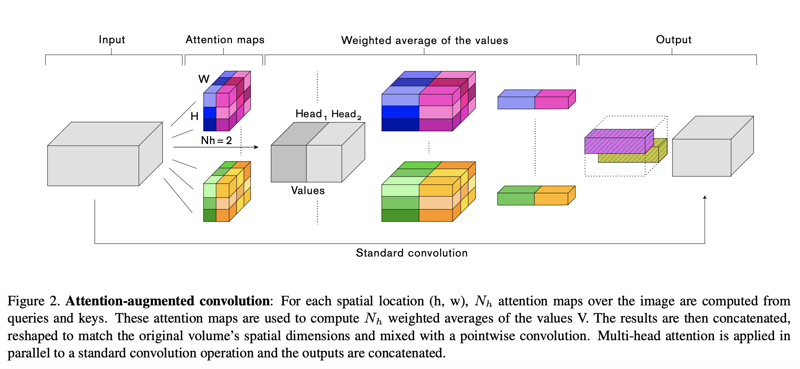

# Attention Augmented Convolution Layer
This repository replicates the Attention Augmented Convolution Layer, as described in (https://arxiv.org/pdf/1904.09925v4.pdf).



# Usage

To use this layer:

```
import tensorflow as tf
from AAConv import AAConv

aaConv = AAConv(
    channels_out=32,
    kernel_size=3,
    depth_k=8, 
    depth_v=8, 
    num_heads=4)
```

The layer can be treated like any other `tf.keras layer`.

```
model = tf.keras.models.Sequential([
    aaConv,
    tf.keras.layers.Flatten(),
    tf.keras.layers.Dense(128, activation='relu'),
    tf.keras.layers.Dropout(0.2),
    tf.keras.layers.Dense(10, activation='softmax')
    ])

model.compile(
    optimizer='adam',
    loss='sparse_categorical_crossentropy',
    metrics=['accuracy'])

model.fit(x_train, y_train, epochs=5)
```


# Notes:

* This layer is only tested to work for input format: NCHW. Existing implementations (see Acknowledgements) using format NHWC.

* This layer does not yet have relative positional encodings.

* Test cases are located [here](https://github.com/JinLi711/Attention-Augmented-Convolution/Attention-Augmented-Convolution/tests.py). 


# Requirements

* tensorflow 2.0.0 with GPU


# Acknowledgements

This work is based on the paper: Attention Augmented Convolutional Networks (https://arxiv.org/pdf/1904.09925v4.pdf).

For other implementations in:
* Pytorch: [leaderj1001](https://github.com/leaderj1001/Attention-Augmented-Conv2d)
* Keras: [titu1994](https://github.com/titu1994/keras-attention-augmented-convs)
* TensorFlow 1.0: [gan3sh500](https://github.com/gan3sh500/attention-augmented-conv) 
